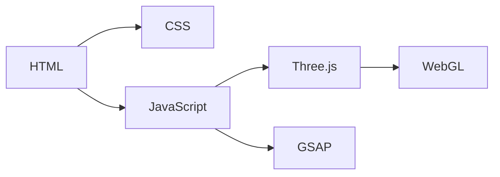

# System Patterns: 3D Metaball Visualizer

## System Architecture

The application follows a modular architecture, separating concerns for rendering, animation, and interaction.

## Key Technical Decisions

- Using Three.js for 3D rendering to simplify WebGL interactions.
- Using GSAP for animation to provide smooth and efficient transitions.
- Implementing a responsive design to support various screen sizes and devices.
- Using requestAnimationFrame for the rendering loop to optimize performance.

## Design Patterns

- **Module Pattern**: JavaScript code is organized into modules for better maintainability and reusability.
- **Observer Pattern**: Event listeners are used to handle user interactions and trigger corresponding actions.

## Component Relationships

- **HTML**: Defines the structure of the application, including the canvas element for rendering.
- **CSS**: Styles the application and provides responsive layout.
- **JavaScript**: Implements the core logic for 3D rendering, animation, and interaction.
- **Three.js**: Provides the 3D rendering engine and handles scene management.
- **GSAP**: Provides the animation engine and handles transitions.
- **WebGL**: Renders the 3D scene to the browser.
