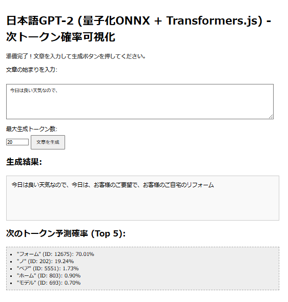

# ブラウザ版 日本語GPT-2 文章生成 & 次トークン確率可視化ツール

## 概要

このプロジェクトは、Webブラウザ上で日本語GPT-2モデル（`rinna/japanese-gpt2-medium` の量子化ONNX版）を実行し、ユーザーが入力したテキストに続く文章を生成するデモンストレーションです。

さらに、文章生成の各ステップにおいて、モデルが次に予測する可能性が高いトークン（単語や文字の一部）上位5件とその確率を表示することで、モデルの内部的な予測プロセスの一部を可視化します。

これは、当初の目的であったアテンション可視化へのステップとして、モデルの内部状態へのアクセスと基本的な可視化を実装したものです。

## デモ (イメージ)



*   テキストを入力し、生成ボタンを押すと、「生成結果」に文章が逐次表示されます。
*   同時に、「次のトークン予測確率 (Top 5)」エリアに、各ステップで予測された上位5トークンとその確率が表示されます。

## 機能

*   ユーザーによる日本語プロンプト入力
*   生成する最大トークン数の指定
*   入力に基づいた日本語文章の生成 (量子化ONNXモデル使用)
*   各生成ステップにおける次トークン予測確率 (Top 5) の表示
*   モデル読み込み中のプログレス表示
*   シンプルなWebインターフェース

## 使用技術

*   **フロントエンド**: HTML, CSS, JavaScript (ES Modules)
*   **MLライブラリ**: [Transformers.js](https://github.com/xenova/transformers.js) (@xenova/transformers)
    *   内部的に ONNX Runtime Web (WASM/WebGL) を使用
*   **モデル**: [rinna/japanese-gpt2-medium](https://huggingface.co/rinna/japanese-gpt2-medium) の量子化済みONNXモデル
    *   `optimum` ライブラリを使用して事前に変換・量子化が必要

## セットアップと実行方法

### 1. モデルファイルの準備

このアプリケーションを実行するには、事前に量子化された `rinna/japanese-gpt2-medium` のONNXモデルファイル一式が必要です。

以下の手順でモデルファイルを取得します。

1.  **ONNX変換・量子化**: Google Colab等を使用し、`optimum` ライブラリを用いて `rinna/japanese-gpt2-medium` をONNX形式に変換し、動的量子化を行います。（[量子化手順のサンプル](https://colab.research.google.com/drive/1C2bmcPlsHXJe7LE0AE83N8ck4tgTqgjq?usp=sharing)）
2.  **ファイル配置**: 変換・量子化によって生成されたファイル群（`onnx_model_quantized` フォルダの内容）を、このリポジトリ（または `index.html` が置かれている場所）の `./onnx_model_quantized/` ディレクトリに配置します。

    **必要なファイル構成:**
    ```
    ./
    ├── index.html
    ├── script.js
    └── onnx_model_quantized/
        ├── config.json
        ├── generation_config.json
        ├── model_quantized.onnx  <-- 量子化されたONNXファイル (名前は異なる場合がある)
        ├── special_tokens_map.json
        ├── spiece.model
        ├── tokenizer_config.json
        └── tokenizer.json
        └── (onnx/decoder_model_merged_quantized.onnx など、内部的な構造の場合もある) <-- 注意: Transformers.jsが期待するファイル構造に合わせる必要がある場合があります。現在の`script.js`は `./onnx_model_quantized/` 直下にある前提です。もし内部に`onnx/`ディレクトリがあり、その中にONNXファイルがある場合は、`script.js` の`MODEL_PATH`を変更するか、ファイル構造を調整してください。
    ```
    *注意*: `model.onnx` のファイル名は、変換・量子化のプロセスによって `model_quantized.onnx` や `decoder_model_merged_quantized.onnx` などになる場合があります。`transformers.js` はディレクトリ内の `*.onnx` ファイルを自動的に検出することを期待しますが、もし読み込みに失敗する場合はファイル名を確認してください。

### 2. ローカルHTTPサーバーの起動

ブラウザのセキュリティ制約のため、モデルファイルをローカルから直接読み込むことはできません。`index.html` ファイルがあるディレクトリで、ローカルHTTPサーバーを起動する必要があります。

Pythonがインストールされている場合、ターミナルで以下のコマンドを実行するのが簡単です:

```
python -m http.server
```

Node.js を使用している場合は `npx serve` なども利用できます。

### 3. ブラウザでアクセス

サーバーを起動したら、Webブラウザを開き、サーバーが表示したアドレス（通常は `http://localhost:8000` または `http://127.0.0.1:8000`）にアクセスします。

"準備完了！..." と表示されたら、テキストを入力して生成を開始できます。

## 既知の問題/制限事項

*   **初期読み込み時間**: 初回アクセス時、`transformers.js` ライブラリとモデルファイルのダウンロード・初期化に時間がかかることがあります。
*   **Tokenizer Config**: 現在の実装では `tokenizer.tokenizer_config` が `undefined` と表示される場合がありますが、トークナイズ自体は動作しています。BOS/EOSトークンIDの扱いに影響がある可能性があります。
*   **ブラウザリソース**: 量子化モデルを使用していますが、それでも比較的大きなモデルであり、ブラウザのメモリやCPUリソースを消費します。特に長い文章を生成しようとすると、ブラウザが遅くなったり、応答しなくなったりする可能性があります。
*   **エラーハンドリング**:基本的なエラー処理は実装されていますが、より詳細なエラー（ネットワーク、メモリ、モデル破損など）のハンドリングは限定的です。
*   **`transformers.js` への依存**: モデルの読み込み、`forward` メソッドの挙動、テンソル操作などは `transformers.js` ライブラリのバージョンや内部実装に依存します。ライブラリの更新によって互換性が失われる可能性があります。
